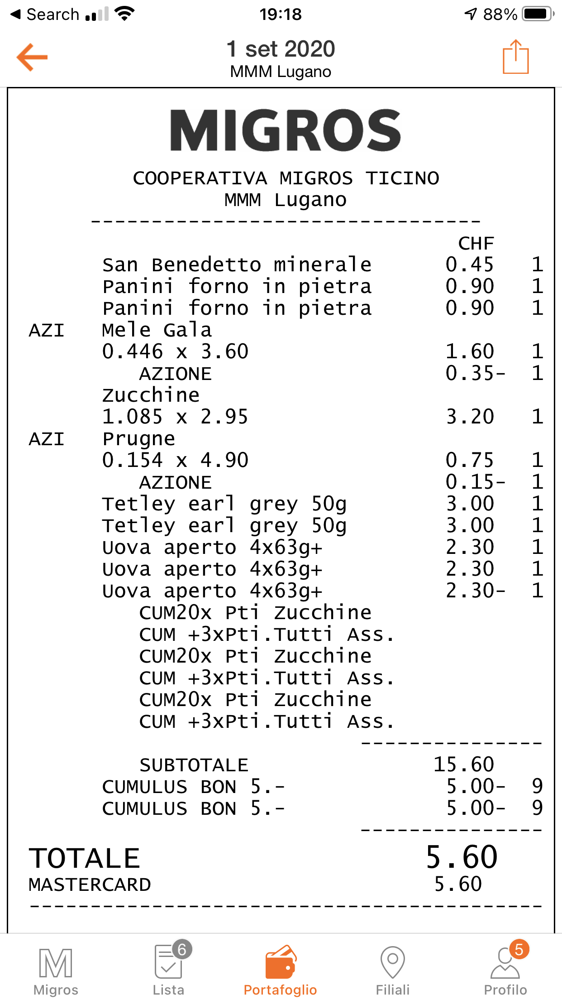

# smart-receipt-scanner

**Smart receipt scanner** is an easy converter of invoices and receipt images into an csv file containing a list of products and prices.

### Features

The script is able to work with images already cropped and of good quality, for example generated with smartphone scanning apps.

Now we support *Migros* and *Lidl* as grocery stores in Switzerland, Italy, Germany etc.

The current version supports many languages but uses Italian as default. In order to change the receipt language, modify the parameter `lan` in the current line: `receipt_text = image_to_string(im, lang='ita')`.

### Prerequisites

> Python 3, Pip, Homebrew

For macOS, using homebrew, run:

```sh
$ brew install tesseract tesseract-lang
```

### Installation

Clone the repository:

```sh
$ git clone https://github.com/GiorgiaAuroraAdorni/smart-receipt-scanner
$ cd smart-receipt-scanner
```

Execute the `requirements.txt` file to install a list of all Python libraries that you need:

```sh
$ pip3 install -r requirements.txt
```

### Usage

To receive help on how to run the script, execute:

```bash
$ python3 smart_receipt_scanner.py -h
```

```bash
> usage: smart_receipt_scanner.py [-h][--image IMAGE] [--txt TXT][--store {migros,lidl,esselunga,manor}][--digital DIGITAL]

	Smart Receipt Scanner

	optional arguments:
  		-h, --help            show this help message and exit
		--image IMAGE         path to the image of the receipt to scan (default: None)
  		--txt TXT             path to the txt containing the receipt (default: None)
  		--store {migros,lidl,esselunga,manor} choose a store to which the receipt refers (default: migros)
  		--digital DIGITAL     specify if the receipt is digital
```

To execute the script:

```bash
$ python3 smart_receipt_scanner.py --image <inputImage>
```

or

```bash
$ python3 smart_receipt_scanner.py --txt <inputFile> [--store lidl]
```

#### Example

Loading the following image 



the output are:

-  a txt file containing the list of items:

  ```
  San Benedetto minerale 0.45 1
  Panini forno in pietra 0.90 1
  Panini forno in pietra 0.90 1
  AZI Mele Gala
  0.446 x 3.60 1.60 1
  AZIONE 0.35 1
  zucchine
  1.085 x 2.95 3.20 1
  AZI Prugne
  0.154 x 4.90 0.75 1
  AZIONE 0.15 1
  Tetley earl grey 50g 3.00 1
  Tetley earl grey 50g 3.00 1
  Uova aperto 4x63g 2.30 1
  Uova aperto 4x63g 2.30 1
  Uova aperto 4x63g 2.30 1
  SUBTOTALE 15.60
  CUMULUS BON 5. 5.00 9
  CUMULUS BON 5. 5.00 9
  TOTALE 5.60
  ```

- and a csv file with a similar format:

  |        | **Product**            | **Price** |
  | ------ | ---------------------- | --------- |
  | **0**  | San Benedetto minerale | 0.45      |
  | **1**  | Panini forno in pietra | 0.90      |
  | **2**  | Panini forno in pietra | 0.90      |
  | **3**  | AZI Mele Gala          | 1.25      |
  | **4**  | zucchine               | 3.20      |
  | **5**  | AZI Prugne             | 0.60      |
  | **6**  | Tetley earl grey       | 3.00      |
  | **7**  | Tetley earl grey       | 3.00      |
  | **8**  | Uova aperto            | 2.30      |
  | **9**  | Uova aperto            | 2.30      |
  | **10** | Uova aperto            | 2.30      |
  | **11** | SUBTOTALE              | 15.60     |
  | **12** | CUMULUS BON            | -5.00     |
  | **13** | CUMULUS BON            | -5.00     |
  | **14** | TOTALE                 | 5.60      |
  

